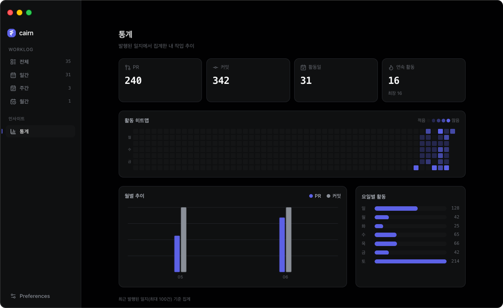

# cairn

[English](README.md) · [한국어](README.ko.md)

> 등산로의 돌탑처럼, 매일 작업 흔적 하나씩 쌓아 길을 남긴다.

cairn 은 매일의 개발 활동 — 여러 레포에 걸친 GitHub PR 과 로컬 Git 커밋 — 을 Claude 로 요약해 Notion 일지로 발행하고, 주간·월간 롤업까지 자동으로 만들어 줍니다.

헤드리스 엔진 위에서 **Electron 데스크톱 앱**으로 동작합니다. 모든 것은 내 기기에 머무릅니다 — Claude Agent SDK 를 사용하고(Anthropic API 직접 호출 X), 소스 코드나 diff 를 외부로 절대 보내지 않습니다.



## 핵심 기능

- **수집** — 여러 레포·계정에 걸친 GitHub PR(작성 + 할당) 과 로컬 Git 커밋
- **요약** — Claude(Agent SDK)가 내가 고른 언어(한국어 또는 영어)와 모델로 일지를 작성
- **발행** — Notion 으로: 일간 일지 + 주간·월간 롤업 자동 생성
- **데스크톱 앱** — 첫 실행 가이드 설정, 원클릭 발행, 원하는 시각의 opt-in 자동 발행(기기 로컬 타임존), 인앱 Notion 뷰어, 통계 대시보드, 다크/라이트/시스템 테마, 한/영
- **로컬 우선·프라이버시** — 머신 로컬 시크릿, 서버 없음, 코드 본문 외부 송신 없음(ADR 0003)

## 요구 사항

- macOS
- Claude Pro/Max 구독 또는 Anthropic API 키 (Agent SDK 용)
- GitHub fine-grained PAT (읽기 전용)
- Notion internal integration 토큰

데스크톱 앱의 첫 실행 설정이 이 연결을 안내하고 config 를 대신 작성해 줍니다.

## 다운로드

[Releases 페이지](https://github.com/ldhbenecia/cairn/releases/latest)에서 최신 `.dmg` 를 받으세요.

- 지금은 **macOS (Apple Silicon / arm64)** 만 지원합니다. Intel·기타 플랫폼은 추후.
- 아직 **코드 서명이 안 돼 있어**(유료 Apple Developer ID 없음) 첫 실행 시 macOS Gatekeeper 에 막힙니다. Applications 로 옮긴 뒤 quarantine 플래그를 한 번 지우세요:

  ```sh
  xattr -cr /Applications/Cairn.app
  ```

  그 후 평소처럼 열면 됩니다. (또는 macOS Sequoia/Tahoe: **시스템 설정 → 개인정보 보호 및 보안 → 그래도 열기**.)
- 새 버전이 나오면 확인해 알려줍니다 — 새 `.dmg` 를 받아 업데이트하세요. (서명되면 매끄러운 자동 업데이트로 전환 예정.)

## 소스에서 빌드·실행

직접 빌드하고 싶다면 가능합니다.

- Node 24 LTS ([.nvmrc](.nvmrc) 참고), pnpm 10+

```bash
git clone https://github.com/ldhbenecia/cairn.git
cd cairn
nvm use
pnpm install

pnpm --filter @cairn/desktop dev   # 데스크톱 앱 실행 (dev)
```

헤드리스 엔진만 (CLI):

```bash
pnpm build
node packages/core/dist/main.js --mode=daily --date=$(date +%F) --dry-run
```

모드: `daily`, `weekly`, `monthly`. `.env` + `worklog.config.json` 수동 설정은 [docs/SETUP.ko.md](docs/SETUP.ko.md)에 정리돼 있습니다 — 다만 데스크톱 앱이 둘 다 생성해 줍니다.

> [ops/](ops/) 의 `launchd` 작업은 **deprecated** 입니다 — 자동 발행은 데스크톱 앱이 담당합니다(ADR 0015). 헤드리스/CLI 전용 설정을 위해서만 남아 있습니다.

## 아키텍처

pnpm 모노레포:

- `packages/core` — 헤드리스 엔진 (수집기 → Claude 요약기 → Notion 발행기), CLI 로 실행 가능
- `packages/desktop` — Electron 앱 (설정 마법사, 수동/자동 발행, 인앱 로그 뷰어, 통계 대시보드, 환경설정)
- `packages/web` — 홍보 사이트 (Next.js, Vercel 배포)

## 문서

| 경로 | 내용 |
|------|------|
| [docs/SETUP.md](docs/SETUP.md) ([한국어](docs/SETUP.ko.md)) | 수동 설정 가이드 |
| [docs/plans/](docs/plans/) | 살아있는 설계 plan |
| [docs/progress/](docs/progress/) | 작업 일지·단계 진행률 |
| [docs/decisions/](docs/decisions/) | 아키텍처 결정 기록(ADR) |
| [CLAUDE.md](CLAUDE.md) / [AGENTS.md](AGENTS.md) | Claude Code / Codex 작업 컨텍스트 |
| [.claude/rules/](.claude/rules/) | 프로젝트 룰 |

## 프라이버시

일지·코드·토큰은 내 기기에 머무릅니다. 내가 설정한 서비스(Notion, GitHub, Claude)로만 전송되며, 그 외 어디로도 보내지 않습니다.

cairn 은 사용자 수·활성 버전을 파악하기 위해 **익명 사용 텔레메트리**(PostHog)를 보냅니다. 기본 켜짐이며 **Preferences → About → 익명 사용 통계**에서 끌 수 있습니다.

- **전송**: 무작위 익명 install id, 앱 버전, OS/arch, 이벤트 이름(`app_launched`, `publish` + 모드·결과).
- **절대 전송 안 함**: 일지 내용, PR 제목, 레포 이름, 커밋 메시지, 파일 경로, 토큰, 그 외 개인정보 일체.

[docs/decisions/0017-anonymous-telemetry.md](docs/decisions/0017-anonymous-telemetry.md) 참고.

## 라이선스

[AGPL-3.0-or-later](LICENSE). Copyright (C) 2026 Donghyeok Lim.

소스는 참고·포크용으로 공개돼 있습니다. 파생물(수정본, 그리고 이 소프트웨어를 네트워크로 노출하는 모든 서비스 포함)은 반드시 AGPL-3.0-or-later 로 라이선스되고 전체 소스를 사용자에게 제공해야 합니다.
