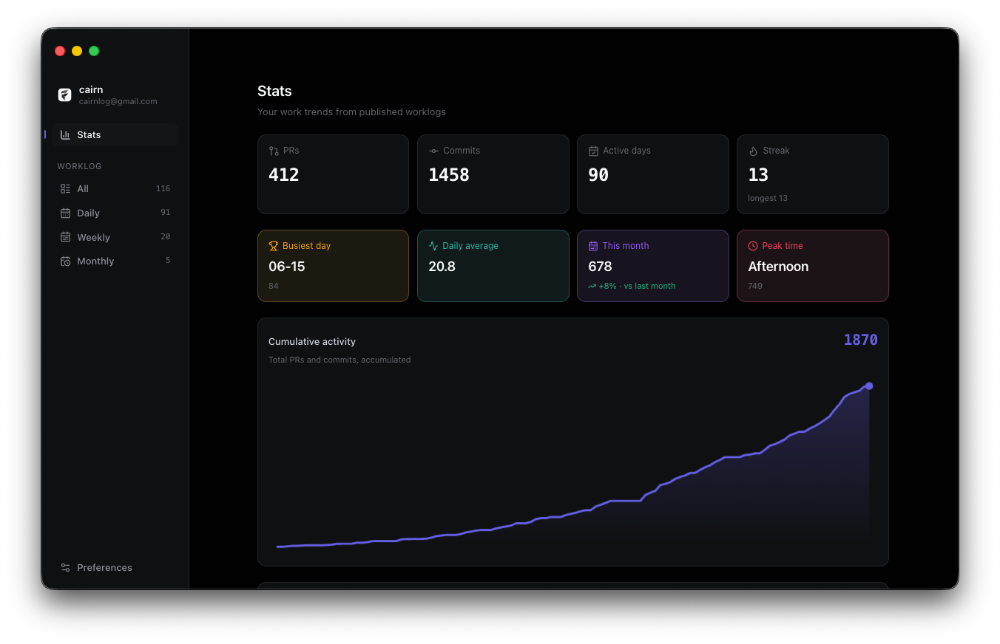

# cairn

[English](README.md) · [한국어](README.ko.md)

> Like a trail cairn, stack one mark of work each day — and leave a path behind.

cairn turns your daily dev activity — GitHub PRs and local Git commits across multiple repos — into a Claude-summarized worklog published to Notion, with automatic weekly and monthly rollups.

It runs as an **Electron desktop app** on top of a headless engine. Everything stays on your machine: it uses the Claude Agent SDK (no direct Anthropic API calls) and never sends source code or diffs to external services.



## Highlights

- **Aggregate** — GitHub PRs (authored + assigned) and local Git commits across multiple repositories and accounts
- **Summarize** — Claude (Agent SDK) writes the worklog in your language (Korean or English), with the summary model you choose
- **Publish** — to Notion: daily logs + automatic weekly/monthly rollups
- **Desktop app** — guided first-run setup, one-click publish, opt-in auto-publish at a time you choose (your local timezone), in-app Notion viewer, a stats dashboard, dark/light/system themes, ko/en
- **Local-first & private** — machine-local secrets, no server, no code-body egress (ADR 0003)

## Requirements

- macOS
- Claude Pro/Max subscription or Anthropic API key (for the Agent SDK)
- GitHub fine-grained PAT (read-only)
- Notion internal integration token

The desktop app's first-run setup walks you through connecting these and writes the config for you.

## Download

Grab the latest `.dmg` from the [Releases page](https://github.com/ldhbenecia/cairn/releases/latest).

- **macOS (Apple Silicon / arm64)** for now. Intel and other platforms may follow.
- The app is **not yet code-signed** (no paid Apple Developer ID), so macOS Gatekeeper blocks it on first launch. After dragging it to Applications, clear the quarantine flag once:

  ```sh
  xattr -cr /Applications/Cairn.app
  ```

  then open it normally. (Alternatively, on macOS Sequoia/Tahoe: **System Settings → Privacy & Security → Open Anyway**.)
- It checks for new versions and notifies you when one is available — download the new `.dmg` to update. (Seamless auto-update will come once the app is signed.)

## Build & run from source

Prefer building it yourself? You can.

- Node 24 LTS (see [.nvmrc](.nvmrc)), pnpm 10+

```bash
git clone https://github.com/ldhbenecia/cairn.git
cd cairn
nvm use
pnpm install

pnpm --filter @cairn/desktop dev   # run the desktop app (dev)
```

Headless engine only (CLI):

```bash
pnpm build
node packages/core/dist/main.js --mode=daily --date=$(date +%F) --dry-run
```

Modes: `daily`, `weekly`, `monthly`. Manual setup of `.env` + `worklog.config.json` is documented in [docs/SETUP.md](docs/SETUP.md) ([한국어](docs/SETUP.ko.md)) — though the desktop app generates both.

> The `launchd` jobs under [ops/](ops/) are **deprecated** — auto-publish is owned by the desktop app (ADR 0015). They remain only for headless/CLI-only setups.

## Architecture

pnpm monorepo:

- `packages/core` — headless engine (collectors → Claude summarizer → Notion publisher), runnable as a CLI
- `packages/desktop` — Electron app (setup wizard, manual/auto publishing, in-app log viewer, stats dashboard, preferences)
- `packages/web` — marketing site (Next.js, deployed on Vercel); also hosts the optional cross-device sync backend (auth + stats API)

### Tech stack

- **Engine** (`packages/core`) — TypeScript · NestJS (standalone) · Octokit · Notion SDK · Claude Agent SDK
- **Desktop** (`packages/desktop`) — Electron · React 19 · Tailwind CSS v4 · electron-vite · electron-updater
- **Web** (`packages/web`) — Next.js · Tailwind CSS v4 · Better Auth + Drizzle ORM + Postgres (cross-device sync)
- **Tooling** — pnpm workspaces · ESLint/Prettier · Husky + lint-staged · GitHub Actions

## Documentation

| Path | Contents |
|------|----------|
| [docs/SETUP.md](docs/SETUP.md) ([한국어](docs/SETUP.ko.md)) | Manual setup guide |
| [CLAUDE.md](CLAUDE.md) / [AGENTS.md](AGENTS.md) | Working context for Claude Code / Codex |
| [.claude/rules/](.claude/rules/) | Project rules |

## Privacy

Your worklogs, code, and tokens stay on your machine. They are only sent to the services you configure (Notion, GitHub, Claude) — never anywhere else.

cairn sends **anonymous usage telemetry** (PostHog) to understand how many people use it and which versions are active. It is enabled by default and can be turned off in **Preferences → About → Anonymous usage stats**.

- **Sent**: a random anonymous install id, app version, OS/arch, and event names (`app_launched`, `publish` with mode + outcome).
- **Never sent**: worklog content, PR titles, repo names, commit messages, file paths, tokens, or any personal information.

## License

[AGPL-3.0-or-later](LICENSE). Copyright (C) 2026 Donghyeok Lim.

Source code is public for reference and forks. Any derivative work — including
modifications and any service that exposes this software over a network — must
also be licensed under AGPL-3.0-or-later and provide its full source to users.
